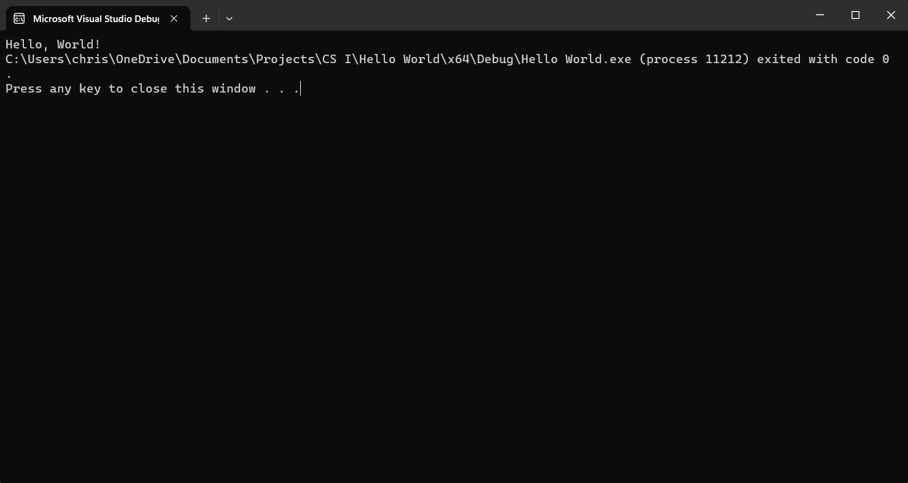
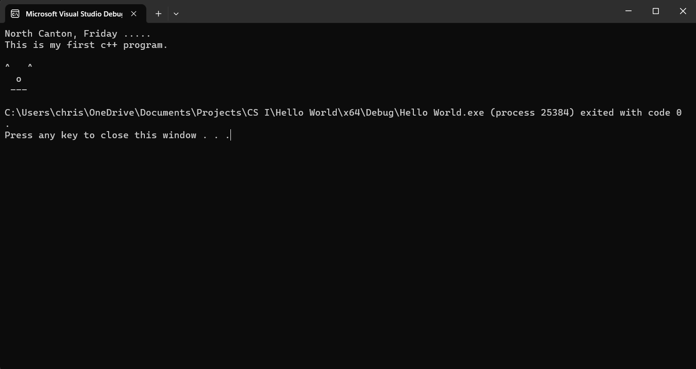

## **CS 13001- CS I Prog.. and Problem Solving**

# **Lab 1: Hello World Lab Report**

January 19, 2024 
Christian Auman

### Introduction:
This lab was to explain the process of installing Visual Studio, and creating a basic Hello World program in c++. This lab should provide a basic hello world program where the program prints "Hello, World!" to the console. This program should use \<iostream\> for the input and output. The other purpose of this lab was to learn how to write a lab report.

### Software Design Methodology: 

### Results: 
**Initial Hello World program**
 
  
**Modified face output**

### Conclusion and Discussion: 

Appendix A 
Include any source code here.
